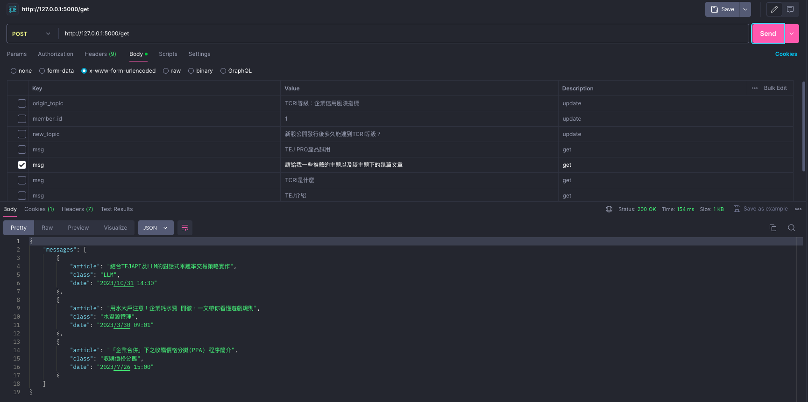
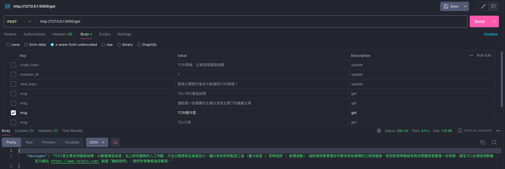
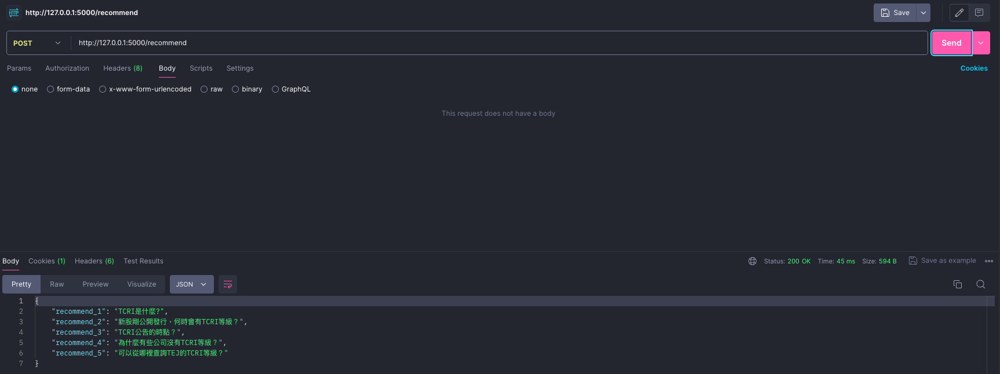
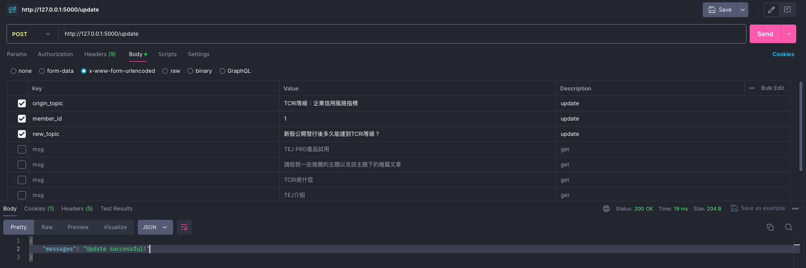

# TEJ AI customer service
<div align="center">
    
    
</div>


---

## GitHub : https://github.com/tejtw/AI-Service

## 使用台智雲模型 FFM-Llama3-70B-chat & FFM-Embedding
- 台智雲首頁 : https://tws.twcc.ai
- 台智雲 LLM : https://tws.twcc.ai/service/ffm-llama3/
- 台智雲 Embedding Model : https://tws.twcc.ai/service/embedding/ 
- 取得 API KEY & URL 放入 config.ini，請注意如果速度太慢或出現 error 的話，請登入台智雲然後換一個 API KEY 試試看

## 啟動測試環境
```
python app.py
```
- 其中有一部分是利用 threading 讓回傳資料給前端和紀錄對話資料進資料庫採非同步進行。
- 確定啟動之後，測試後端環境請使用 [Postman](https://www.postman.com/) 進行測試，依據對應路由輸入變數進行單元測試！

| Route      | Methods | Request                            | Response Type | Describe |
| ---------- | ------- | ---------------------------------- | ------------- | -------- |
| /          | GET     | None                               | html template | HTML原始碼  |
| /get       | POST    | msg                                | JSON          | 接收使用者輸入  |
| /recommend | POST    | None                               | JSON          | 精選問答     |
| /update    | POST    | origin_topic, member_id, new_topic | JSON          | 更新對話紀錄主題 |

#### 回傳結果如下圖：<br>





## RAG
### 搜尋引擎
- qdrant2answers.py
	- 取得三篇推薦文章、Qdrant 向量相似度比對搜尋、複寫 frequency 進向量資料庫

### Embedding Model
- TWSC_embedding.py
	- 使用台智雲 Embedding Model

- data2qdrant.py (openAI版本)
	- 使用 langchain_openai improt OpenAIEmbeddings 進行調用openAI Embedding Model

### 串接大語言模型
- intelligent_customer_service.py
	- 從 ffm_model.py 匯入 LLM，使用台智雲 FFM-Llama3-70B-chat

- intelligent_customer_service.py (openAI版本)
	- 從 GPT_model.py 匯入 LLM，使用 GPT-4o 模型

| 函數              | 功能                                        |
| --------------- | ----------------------------------------- |
| search          | 整理 RAG 回傳的結果                              |
| chat            | search 函數整理完的結果放入 LLM，並產出要回覆使用者的 response |
| system          | 如果前端是按下推薦文章按鈕，會回傳推薦的文章                    |
| AI_topic_create | 根據使用者輸入的問題和 LLM 的回答，自動生成一個對話主題            |

### 精選問題
- point_out_function.py
	- 根據 LLM response 的 keyword 來取得五個推薦問題，並按照 "frequency" 排序

## 更新資料庫
- data2qdrant.py (上線後南宗哥會開後台)
  - QA 問答匯入 Qdrant 資料庫
- article2qdrant.py (上線後南宗哥會開後台更新)
  - 推薦文章匯入 Qdrant 資料庫

## 紀錄問答資料庫 (MySQL)
### 安裝 MySQL (Docker) - 第一次使用才需創建 (可參考 PDF 檔)
#### 下載 Docker Desktop : https://www.docker.com/products/docker-desktop/
1. Terminal 執行指令 (請確保與 docker-compose.yml 檔在同一個路徑)：
   - docker-compose up -d
2. 開啟 MySQL 網頁操作介面
   - http://localhost:8080/ or http://127.0.0.1:8080/
3. 登入 MySQL
   - 預設帳號：root
   - 預設密碼：123456
4. 建立 Table - TEJ_AI_Service_Chat_Memory
   - 執行 chat_history_db_create.py
   - 若執行程式之後在 UI 介面沒看到資料表，請在 UI 介面建立名為 `TEJ_AI_Service_Chat_Memory` 的資料表，會跳出 error 說次資料表已被建立，然後回到 DB 路徑即可看到 `TEJ_AI_Service_Chat_Memory` 這個資料表

### 創建資料庫 chat_history_db_create.py
#### 資料表1 : Members
- 儲存會員資料，包括會員ID、用戶名、電子郵件、密碼和創建時間。

```
CREATE TABLE Members (
    member_id INT AUTO_INCREMENT PRIMARY KEY,
    username VARCHAR(50) NOT NULL UNIQUE,
    email VARCHAR(100) NOT NULL UNIQUE,
    password VARCHAR(255) NOT NULL,
    created_at TIMESTAMP DEFAULT CURRENT_TIMESTAMP
);
```

#### 資料表2 : Topics
- 儲存討論主題資料，包括主題ID、會員ID、標題、內容和創建時間。會員ID作為外鍵參照 Members 資料表。

```
CREATE TABLE Topics (
    topic_id INT AUTO_INCREMENT PRIMARY KEY,
    member_id INT NOT NULL,
    title varchar(255) CHARACTER SET utf8mb3 COLLATE utf8mb3_general_ci NOT NULL,
    created_at TIMESTAMP DEFAULT CURRENT_TIMESTAMP,
    FOREIGN KEY (member_id) REFERENCES Members(member_id) ON DELETE CASCADE
);
```

#### 資料表3 : Posts
- 儲存問題文章和回答文章的資料，包括文章ID、主題ID、會員ID、內容、父文章ID（用來表示回答文章），以及創建時間。主題ID和會員ID作為外鍵參照相應的資料表。父文章ID作為外鍵參照 Posts 資料表自身，表示回答文章。

```
CREATE TABLE Posts (
    post_id INT AUTO_INCREMENT PRIMARY KEY,
    topic_id INT NOT NULL,
    member_id INT NOT NULL,
    content TEXT CHARACTER SET utf8mb3 COLLATE utf8mb3_general_ci NOT NULL,
    parent_post_id INT DEFAULT NULL,
    created_at TIMESTAMP DEFAULT CURRENT_TIMESTAMP,
    FOREIGN KEY (topic_id) REFERENCES Topics(topic_id) ON DELETE CASCADE,
    FOREIGN KEY (member_id) REFERENCES Members(member_id) ON DELETE CASCADE,
    FOREIGN KEY (parent_post_id) REFERENCES Posts(post_id) ON DELETE CASCADE
);
```

### 紀錄對話資料庫 chat_history.py
- `Members` 資料表

| 函數               | 功能   |
| ---------------- | ---- |
| members_login    | 會員登入 |
| members_register | 會員註冊 |

- `Topics` 資料表

| 函數               | 功能                                   |
| ---------------- | ------------------------------------ |
| topic_create     | 根據 member_id, title 新增一個主題           |
| topic_search     | 搜尋特定 member 的所有主題                    |
| topic_particular | 取得特定 member_id, title 的資訊            |
| topic_update     | 根據 topic_id, member_id, title 更改主題名稱 |
| topic_delete     | 刪除特定 member_id, title 的主題            |

- `Posts` 資料表

| 函數           | 功能                                                                                                                                                                         |
| ------------ | -------------------------------------------------------------------------------------------------------------------------------------------------------------------------- |
| posts_create | 根據 topic_id, member_id, contents 新增一個對話內容，會計算這個 topic_id 下的對話紀錄次數，如果餘數為 0，代表這個 contents 是 user 輸入的內容；反之如果餘數為 1，則是回答給使用者的內容。<br>(只有回答給使用者的內容會有父文章ID，父文章ID就是user輸入的 post_id) |
| post_search  | 搜尋 topic_id, member_id 的所有對話紀錄                                                                                                                                             |


## Qdrant 資料庫紀錄 QA 問答資料 & 推薦文章資料
### 第一次使用才需創建
#### 下載 Docker Desktop : https://www.docker.com/products/docker-desktop/

1. 在 Docker 下載 qdrant 環境
	- docker pull qdrant/qdrant
2. 在 Docker 啟動 qdrant 環境
	- docker run -d --name qdrant -p 6333:6333 qdrant/qdrant
3. 開啟瀏覽器輸入網址 : http://localhost:6333/dashboard
	- 看到頁面即安裝成功

### 文本資料整理規格 & 向量資料庫欄位
- QA 向量資料庫
	- 分為三個部分 -\> `Point`, `Payload`, `Vectors`
		- Point : 當筆資料在 qdrant 資料庫內的名字
		- Payload -\> `question`, `answer`, `id`, `keyword`, `flag`, `frequency`
			- `frequency` 欄位是計算 RAG 的結果次數，越高代表這個問題越常被客戶提到
		- Vectors : `question` & `flag` 欄位轉向量儲存，維度為 1536
- 推薦文章向量資料庫
  - 分為三個部分 -\> `Point`, `Payload`, `Vectors`
    - Point : 當筆資料在 qdrant 資料庫內的名字
    - Payload -\> `class`, `date`, `id`, `tag`, `title`, `tag1`, `tag2`, `tag3`, `tag4`, `tag5`, `tag6`,
      - `tag1~6` 欄位是每個標籤，會隨機選擇標籤分類來做推薦
    - Vectors : `title` 欄位轉向量儲存，維度為 1536